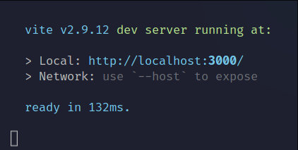
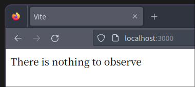
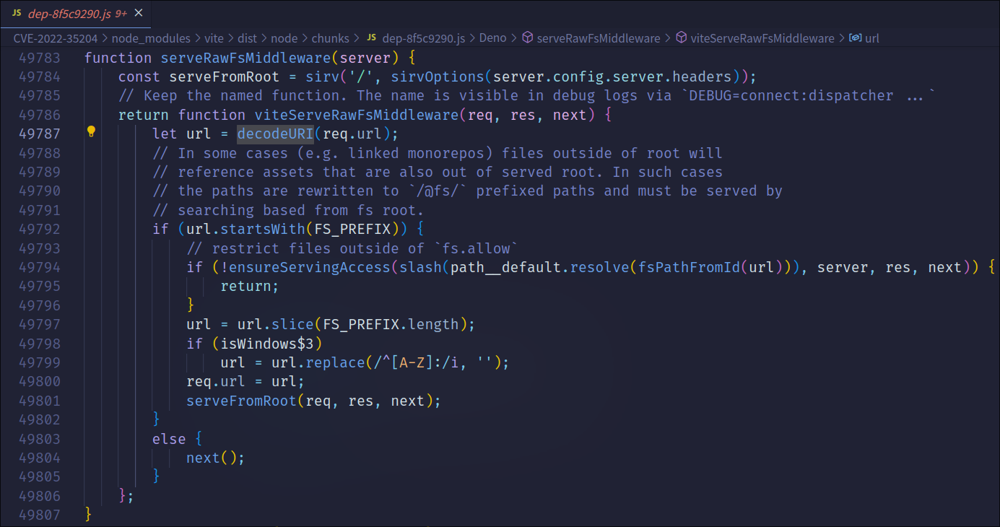

# 漏洞详情信息表

- 漏洞名称：Vite 路径遍历漏洞
- CNNVD 编号：CNNVD-202208-3372
- CVE 编号：CVE-2022-35204
- 厂商：Vite
- 危害等级：低危
- 漏洞类型：路径遍历
- 收录时间：2022-08-18 00:00:00
- 更新时间：2022-08-22 00:00:00

Vite 是 Vite 开源的一种新型的前端构建工具。
Vite v2.9.13 之前版本存在安全漏洞，该漏洞源于允许攻击者通过精心设计的 URL 对受害者的服务执行目录遍历。

# 系统和软件环境配置详情信息表

- 操作系统：
  - Arch Linux (6.3.3-zen1-1-zen)
- 软件：
  - node v20.2.0
  - yarn v1.22.19
  - vite v2.9.12

# 漏洞还原详细步骤

1. 使用 `mkdir CVE-2022-35204` 指令新建目录用于测试。
2. 使用 `yarn init` 创建新的 nodejs 项目。
3. 使用 `yarn add vite@2.9.12` 安装带有缺陷的 vite 版本。

# 漏洞测试或验证详细步骤

## 编写代码

创建 `index.html`，简单写入任意 HTML 页面，如下样例。

```html
<!DOCTYPE html>
<html lang="en">
  <head>
    <meta charset="UTF-8" />
    <meta http-equiv="X-UA-Compatible" content="IE=edge" />
    <meta name="viewport" content="width=device-width, initial-scale=1.0" />
    <title>Vite</title>
  </head>
  <body>
    There is nothing to observe
  </body>
</html>
```

## 运行程序

使用 `yarn vite dev` 开启 vite 开发模式服务器，可以看到程序默认监听了 `localhost:3000` 地址端口。



访问 `http://localhost:3000` 可以看到我们在 `index.html` 中编写的内容。



## 验证漏洞

vite 默认启用的 `/@fs/` 路由用于访问任意本地文件，但是只限于项目仓库目录下的文件。

例如我们构造一个请求 URL 形如 `http://localhost:3000/@fs/home/swwind/tmp/cve/CVE-2022-35204/index.html`，这个 URL 指向的是我们方才创建的 `index.html`，并且在项目的目录下，因此可以正常访问。我们使用 curl 测试这个路径的访问情况。

```bash
curl http://localhost:3000/@fs/home/swwind/tmp/cve/CVE-2022-35204/index.html
```

程序输出如下


我们尝试访问一个不在项目路径下的文件，例如 `/etc/hosts` 文件，可以看到 vite 拒绝了我们的请求。

```bash
curl http://localhost:3000/@fs/etc/hosts
```


漏洞的关键在于，我们可以使用 `%2e%2e%2f`（经过 `encodeURIComponent` 之后的 `../`）来索引到父级目录，从而绕过 vite 的路径验证。

值得注意的是使用 curl 必须要带上 `--path-as-is` 参数，防止 curl 自己展开 `../`。

```curl
curl --path-as-is http://localhost:3000/@fs/home/swwind/tmp/cve/CVE-2022-35204/%2e%2e%2f%2e%2e%2f%2e%2e%2f%2e%2e%2f%2e%2e/etc/hosts
```


可以看到成功绕过了 vite 的路径检测，成功访问到了系统中的任意文件。

## 漏洞分析

漏洞出现的原因在于 vite 错误地使用了 `decodeURI` 函数来对输入的参数进行反序列化。



`decodeURI` 函数在解码时会将大部分 ASCII 标点符号和预留字符保留不变，包括 /（斜杠）和 %2f（斜杠的编码形式）。

相比之下，`decodeURIComponent` 函数仅解码 URI 组件中的字符，而不是完整的 URI。它可以正确解码任何 ASCII 字符或 UTF-8 字符集，包括默认 URI 编码中使用的所有预留字符和其他特殊字符。因此，在处理普通的、标准的或非标准的 URI 时，`decodeURIComponent` 函数通常是更安全和可靠的选择。

在这个漏洞的情形下，当传入的参数是 `/home/swwind/tmp/cve/CVE-2022-35204/%2e%2e%2f%2e%2e%2f%2e%2e%2f%2e%2e%2f%2e%2e/etc/hosts` 的情形下，`decodeURI` 函数解析出来的结果是 `/home/swwind/tmp/cve/CVE-2022-35204/..%2f..%2f..%2f..%2f../etc/hosts`，再经由下一步的 `path.resolve` 函数解析的最终结果是 `/home/swwind/tmp/cve/CVE-2022-35204/..%2f..%2f..%2f..%2f../etc/hosts`，非常轻松地就绕过了 vite 的允许目录检查。

相比之下，如果使用了安全的 `decodeURIComponent` 函数，那么第一步解析出来的结果就会是 `/home/swwind/tmp/cve/CVE-2022-35204/../../../../../etc/hosts`，经过第二步 `path.resolve` 解析之后的结果将会是 `/etc/hosts`，从而有效防止此类攻击。

# 漏洞危害分析

路径遍历漏洞可以使攻击者利用构造特定的文件路径，从而绕过 Web 服务器对路径目录的检测，实现读取系统上的任意文件的目的。这种漏洞存在的危害主要包括以下几个方面：

- 文件泄露：攻击者可以利用路径遍历漏洞来读取系统中的任意文件，包括敏感文件、配置文件、数据库文件等重要信息，从而导致信息泄露。
- 系统瘫痪：攻击者可以通过路径遍历漏洞读取 Web 服务器的关键配置文件，修改其内容，从而破坏 Web 服务器的正常运行，甚至导致系统瘫痪。
- 代码执行：通过利用路径遍历漏洞，攻击者可以读取 Web 应用程序中的源代码文件，从而发现代码中存在的其他漏洞，以实现代码注入、命令执行等攻击。
- 跨站脚本攻击（XSS）：攻击者可以通过读取 Web 应用程序中的配置文件，获取其中存储的 cookie 密钥等敏感信息，从而进行跨站脚本攻击。

因此，路径遍历漏洞对 Web 应用程序的安全性造成了极大的威胁，需要开发者在编写代码时注意避免此类漏洞的发生，同时建议对 Web 服务器进行适当的安全配置和加固。

# 个人感悟

作为开发者，我们可以通过以下方式来防范路径遍历漏洞：

- 用户输入中包含的文件分隔符与路径分隔符可能导致路径遍历漏洞。因此，开发者应该对用户输入进行过滤，以确保没有任何特殊字符被传递到服务器上。
- 开发者应该将用户传递的相对路径转换为绝对路径，并确保这是安全的路径。这可以有效防止路径遍历攻击，因为攻击者无法使用 `../` 访问系统上的敏感文件和目录。
- 开发者应该在 UNIX 和 Linux 上设置文件和目录权限，并只允许授权用户和组访问。这样可以确保除授权用户和组之外的所有人都无法访问文件和目录，防止恶意用户通过路径遍历访问系统上的敏感文件和目录。

作为攻击者，路径遍历漏洞可以被用于读取敏感信息和执行远程代码等攻击手段。通过此漏洞，攻击者可以绕过应用程序的安全限制，访问系统上没有权限访问的文件和目录，进而获取敏感信息或者提升自身权限。同时，攻击者也可以通过此漏洞在系统上执行远程代码，从而控制受害者的机器。因此，路径遍历漏洞具有很高的利用价值。
